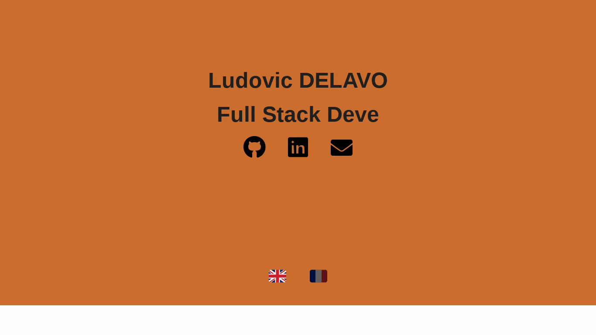

<h1>Ludovic DELAVOIS website</h1>

Check my website at <a href="https://delavois.com">delavois.com</a>.

 &nbsp;  &nbsp;  &nbsp;  &nbsp;  &nbsp; 

This project is the source code of my personal developer portfolio.

Secured and optimized with CloudFare

<h3>Preview</h3>

Gif made with <a href="https://github.com/glgoose/gif-scroll-animation">gif-scroll-animation</a>
(emojis bug on this gif but not on the website)

<h3>Components: </h3>

<a href="https://github.com/stephane-monnot/react-vertical-timeline">React Vertical Timeline</a>  
<a href="https://github.com/rcaferati/react-awesome-slider">React Awesome Slider</a>  
<a href="https://github.com/catalinmiron/react-typical">React Typical</a>  
<a href="https://iconify.design/icon-sets/?query=angular">Iconify Design</a>  
<a href="https://www.w3docs.com/snippets/css/how-to-create-polaroid-image-with-css.html#">Polaroid effect</a>  
<a href="https://www.npmjs.com/package/@gmana/react-go-top">React Go To Top</a>  
<!-- <a href="https://tholman.com/github-corners/">GitHub Ref Corner</a> -->

<h3>TODO list:</h3>

- [ ] Add github info via github API

- [ ] Make more Back End projects to connect with this website

- [ ] Host json data into a cloud Database and join with an API

- [x] ~~Correct projects pictures scaling~~

- [x] ~~Add dynamic button to go back up~~

- [x] ~~Edit design and colors~~

- [x] ~~Add responsive nav bar~~

- [x] ~~Add a Hobbies section~~ 

Template by <a href="https://dorota1997.github.io/react-frontend-dev-portfolio">Dorota 1997</a> with React.
